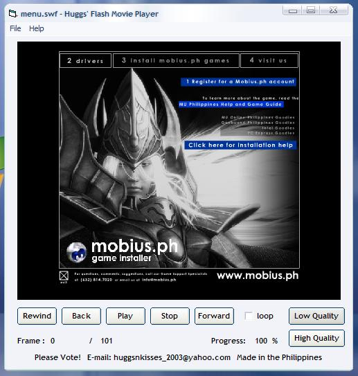



## Huggs' Shockwave Flash Movie Player 1\.0 BETA

### Description

This example shows how to see flash animations. Included here are the controls, progress rate, frame rate, and quality adjustments. Compatible to all Windows OS and you should have Flash 6 ActiveX Control and over.. This is a BETA version and still updating. If there are bugs or errors, please tell me, give some comments and suggestions. Please Vote for my Project.
 
### More Info
 

             |
---                |---
**Submitted On**   |2005-11-04 15:47:00
**By**             |[John Aso](https://github.com/Planet-Source-Code/PSCIndex/blob/master/ByAuthor/john-aso.md)
**Level**          |Beginner
**User Rating**    |4.3 (13 globes from 3 users)
**Compatibility**  |VB 6\.0
**Category**       |[Miscellaneous](https://github.com/Planet-Source-Code/PSCIndex/blob/master/ByCategory/miscellaneous__1-1.md)
**World**          |[Visual Basic](https://github.com/Planet-Source-Code/PSCIndex/blob/master/ByWorld/visual-basic.md)
**Archive File**   |[Huggs'\_Sho19563312132005\.zip](https://github.com/Planet-Source-Code/john-aso-huggs-shockwave-flash-movie-player-1-0-beta__1-63635/archive/master.zip)

